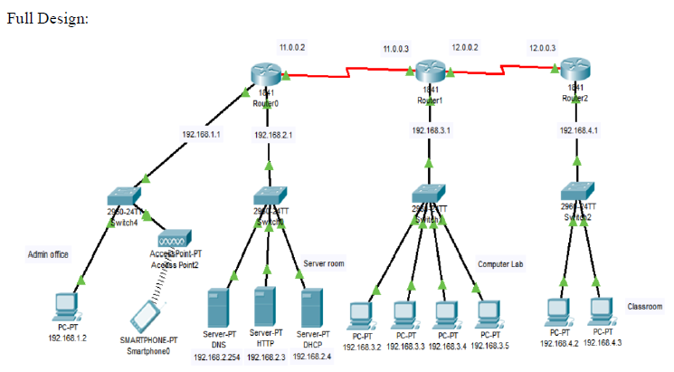

# computer-networks-project
This project entitled “Design a full-fledged network for an organization with multiple subnets” is an original work done by me, in partial fulfillment of the requirements for the degree “Bachelor of Science in Computer Science and Engineering” at Computer Science Department, East West University. It's built using Cisco Packet Tracer.

#### Introduction
INTERNATIONAL APEX UNIVERSITY like any other large educational institution requires a complex networked system to deal with its business processes like admissions, advising, results, eTender, library management, accounts and so on. In this project I have tried to provide a simple and minimalistic network design to handle these complex tasks.

#### List of Components Used
7 PCs, 4 switches, 3 routers, 1 DHCP server, 1 HTTP server, 1 DNS server, straight through wires, 1 smartphone, 1 Access Point-PT

#### Network Design

